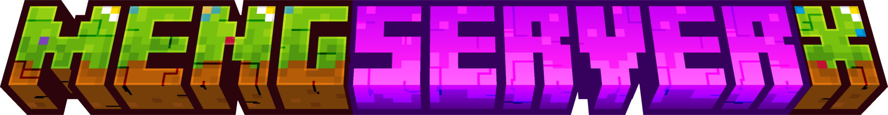

## 📋MengServerX

### 🌏Support Languages:

### 🔍Support Features:
- [x] Multi-language support
- [x] Modify the chat format
- [x] Player name whitelist
- [x] Keep Inventory
- [x] Terrain protection
- [x] Clean drop items
- [x] Digging scoreboard
- [x] Chat with ollama
- [x] Player-to-player teleportation
- [x] Announcement of the whole server
- [x] Command helper

### 🧩Design Concept:
This plugin adopts a modular design concept, and the various functions are not closely related to each other, which is convenient for later maintenance and update.

### 📌Special Notes:
This plugin enables the ***whitelist*** by default, if you need to turn it off, please modify the ***config.yml***, thank you for your understanding.

### 🔨How To Build:
- Use the `git clone https://github.com/HuanMeng-official/MengServerX.git` clone source code
- Importing this project into the IDE (IDEA is recommended)
- Use Maven to build the source code
- Obtain the jar from the target directory

### 💡Contributors:
|HuanMeng|Aurora|WanNing|
|:------:|:----:|:-----:|
|https://github.com/HuanMeng-official|https://github.com/Aurora-official|https://github.com/WanNing-official|
